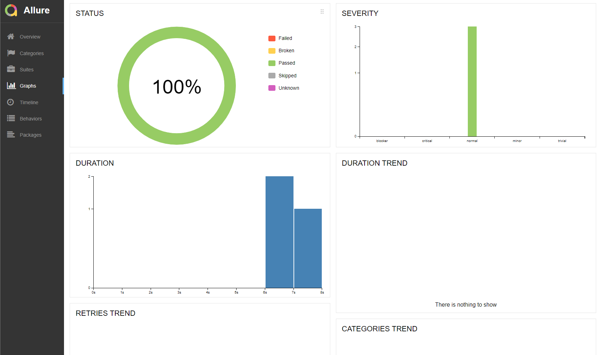
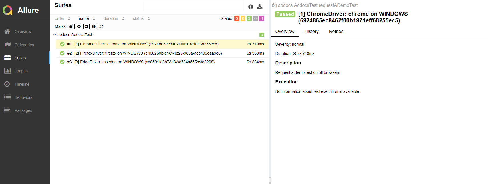

AODocs Selenium technical test
=

[](https://github.com/Ababadon/aodocs-selenium-techtest/actions/workflows/maven.yml)
[](http://maven.apache.org)


See original request [here](#original-test-description)

## Prerequisites
* Java JDK: 10 or higher
* Maven: 3.3.9 or higher
* Chrome
* Firefox
* Edge
* [OPTIONAL] Allure reports (https://docs.qameta.io/allure)

## Tested With
* JDK : 11.0.11
* Maven : 3.8.1
* Windows 11 with :  
o Chrome version : 97.0.4692.71  
o Firefox version : 96.0.1  
o Edge version : 97.0.1072.62

All Tests are performed on Chrome, Firefox and Edge sequentially  
**TODO**: Run them in parallel.

## Configuration
Default values in ```TestConfig.properties``` (based on http://owner.aeonbits.org/docs/usage/)
```properties
google=https://www.google.com
company=aodocs
companySite=www.aodocs.com
demo=Request a demo
firstName=florian

expectedInputError=Please complete this required field.
expectedEmailError=Email must be formatted correctly.
expectedSelectError=Please select an option from the dropdown menu.
expectedGlobalError=Please complete all required fields.
```

## Run locally
 
```$ mvn test```

### Allure Results reports:  
```$ allure serve target/allure-results```

#### Examples



## Continuous integration
### For now use GitHub Actions :
```yaml
name: AODOCS Selenium tests

on:
  push:
    branches: [ main ]
  pull_request:
    branches: [ main ]
  schedule:
    - cron:  '0 1 * * *'

jobs:
  build:

    runs-on: ubuntu-latest

    steps:
    - uses: actions/checkout@v2
    - name: Set up JDK 11
      uses: actions/setup-java@v2
      with:
        java-version: '11'
        distribution: 'temurin'
        cache: maven
    - name: Build with Maven
      run: mvn -B test --file pom.xml
```

Tests are triggered on any push or pull request  
AND  
**Every day at 1AM.**

### Results :  
[](https://github.com/Ababadon/aodocs-selenium-techtest/actions/workflows/maven.yml)

## Run with docker
**TODO**


# Original Test Description

This project is about assessing QA automation abilities.

## Getting Started

### Prerequisites
* Java JDK: 10 or higher
* Maven: 3.3.9 or higher

## Test Objectives
The marketing team ask you to write an automation test to validate how prospect access to our website, and the form to request a demo of the product.
 
The test steps are:
 1. Search AODocs in Google
 2. In the result, open the website www.aodocs.com
 3. Into the website click on the "Request a demo" button
 4. Fill the form with:
     * your first name
     * set empty in the "Last Name" field
     * fill a random string in the "Your Email" field
     * choose a value in Company Size
 5. Check the error messages

## Notes
In this project you can find a utility class "WebDriverUtility" to help you to start a browser locally.
To write the test, you need to use Junit 5 already configured in pom.xml
